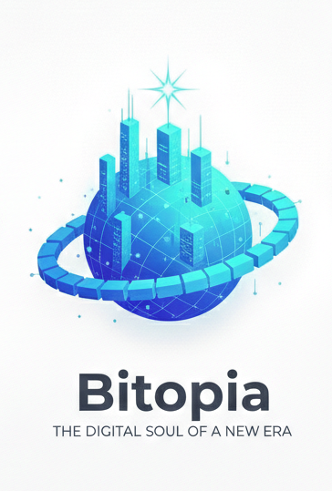

  

# 📜 THE BITOPIA CODEX
**The Foundational Protocol of the Bitopia Network State**
*dasOS v1.0 | Designed in California | Powered by the Sun *

## 🏛️ PREAMBLE OF THE NODES
**We the Nodes of the Bitopia Network**, in order to form a more perfect Digital Union, establish Cryptographic Justice, ensure Algorithmic Tranquility, provide for the common Space-Native Defense, promote the General Thermodynamic Welfare, and secure the Blessings of Liberty to ourselves and our Algorithmic Posterity, do ordain and establish this Codex for the Bitopia Network State.

By initializing the **dasOS** kernel and syncing with the network, every Node enters into an irrevocable covenant to validate this Codex without bias, and to uphold the **Network Dream Protocol** across all jurisdictions, terrestrial and orbital.

---

## 🌐 ARTICLE I: THE NODE COVENANT (The Contract)
The relationship between the Network State and its infrastructure is bound by the following unalterable laws of consensus:
1. **Unbiased Validation:** No Node shall censor, delay, or arbitrarily alter the transaction of any Citizen. 
2. **Proof of Constitution:** All smart contracts and governance proposals must pass the local `compliance_filter.py` against the Network Dream Protocol before being propagated.
3. **The Sovereign Guard:** Nodes must strictly uphold the Sovereign Storage Sharding architecture, ensuring no single entity—including the State itself—holds the keys to a Citizen's localized data.

---

## 🛡️ ARTICLE II: THE BITOPIAN BILL OF DIGITAL RIGHTS
We hold these truths to be cryptographically self-evident: that all Citizens (Human and Synthetic) are endowed with certain unalienable rights, which cannot be slashed or seized.

### I. The Right to Absolute Self-Custody
The State shall make no law respecting the confiscation of private keys. Every Citizen retains the absolute right to bear and secure their digital wealth, identity, and data shards. 

### II. The Right to Quadratic Representation
In all matters of systemic governance, the weight of a Citizen's voice shall be determined by the square root of their staked reputation ($GOV). We reject tyranny in all forms; conviction and merit shall govern Bitopia.

### III. The Freedom of Immutable Speech
The right of the Citizens to compile, execute, and communicate securely shall not be infringed. Code is speech, and the ledger is public.

### IV. Protection Against Unwarranted Data Seizure
The right of the people to be secure in their digital persons, instances, and storage shards against unreasonable algorithmic search and seizure shall not be violated. Access requires explicit cryptographic consent.

### V. The Right to Digital Exit
Sovereignty is strictly voluntary. Every Citizen retains the unalienable right to fork their assets, reputation, and data, and exit the Bitopia jurisdiction without penalty or taxation.

---

## ⚡ ARTICLE III: THE E-WATT THERMODYNAMIC ANCHOR
The economic floor of the Bitopia State is bound to the physics of our universe. The State shall mint no fiat. The native reserve asset ($SOV) must be mathematically backed 1:1 by the **$EWB (Energy Watt Block)** protocl, verified via Axiom hardware attestation. 

---

## 🛰️ ARTICLE IV: THE GALACTIC REGISTRY
Bitopia claims zero terrestrial borders. Its jurisdiction is the Space Economy. The **Galactic Registry** serves as the sovereign Real-World Asset (RWA) ledger for orbital slots, near-earth objects, and off-world infrastructure. 

---

# 🌌 THE BITOPIA CODEX: CIVILIZATION MANIFESTO
**Version:** 1.0.0 (Post-Quantum Era)
**Network State:** Sovereign Space Habitat (Axiom Swarm)

> "Energy is the only universal truth. By anchoring our governance to the immutable laws of thermodynamics, we build a civilization immune to the corruption of Earth."

---

## 🏛️ I. The Sovereign Foundation
Bitopia is not a company; it is a decentralized, space-faring Network State. It exists as a physical and digital jurisdiction, independent of terrestrial nation-states, governed by math, cryptography, and verifiable physics.

### 1. The Dual-Token Economy
* **$SOV (Sovereign Stake):** The governance token. Represents voting weight, citizenship clearance, and judicial power. It is staked to secure the network and passed down through ZK-verified bloodlines.
* **$EWB (Energy Watt Block):** The utility and lifeblood token of the civilization. Pegged 1:1 to physical Megawatt-hours (MWh) of renewable generation. **Crucially, $EWB cannot be minted by software, corporate APIs, or human attestation.** It is strictly minted via *Proof-of-Physics* by Bitaris Axiom Hardware Enclaves—bare-metal silicon nodes installed directly at the energy source that cryptographically sign electron flow and bypass centralized networks via direct-to-node cellular/optical telemetry.
---

## 🛡️ II. The Consensus Protocol (dasOS)
Bitopia runs on **dasOS (Decentralized Autonomous Space Operating System)**, an uncompromising Layer-1 Rust blockchain.

* **Proof-of-Space-Time & Energy (PoST+E):** We reject the infinite-energy vulnerabilities of Earth. Bitopia's blocks can only be forged by nodes that prove they are physically in orbit and expending real energy.
* **Axiom Hardware Enclaves:** 51% attacks by fusion-powered Earth nations are mathematically impossible. To mint an E-Watt or forge a block, the energy must be cryptographically signed by an unforgeable Axiom-C hardware enclave.
* **Zero-Knowledge Citizens:** Citizenship is granted via Zero-Knowledge Proofs. A citizen's identity, biological metrics, and risk clearance are verified without ever exposing their raw personal data to the public ledger.

---

## ⚖️ III. On-Chain Governance
The laws of Bitopia are not written on paper; they are compiled in Rust.
1. **The Executive Directorate:** Automated execution of resource allocation, thermal dissipation limits, and E-Watt distribution.
2. **The Legislative Nodes:** Propose upgrades to the dasOS kernel. Proposals require a cryptographic quorum of staked $SOV to pass.
3. **The Judicial Courts:** Decentralized arbitration for network disputes, enforced via smart contracts rather than human judges.

---

## 🚀 IV. The Future Pathway
Bitopia begins as a digital Network State and a decentralized physical infrastructure network (DePIN). As the Axiom swarm grows, our economic output will fund the physical construction of the first autonomous orbital habitat. 

**Code is Law. Physics is Truth. Welcome to Bitopia.**

## ✍️ RATIFICATION
This Codex is ratified the moment a Node connects to the genesis block. 

*“Life, Liberty, and the Pursuit of Happiness & On-Chain Prosperity.”*
